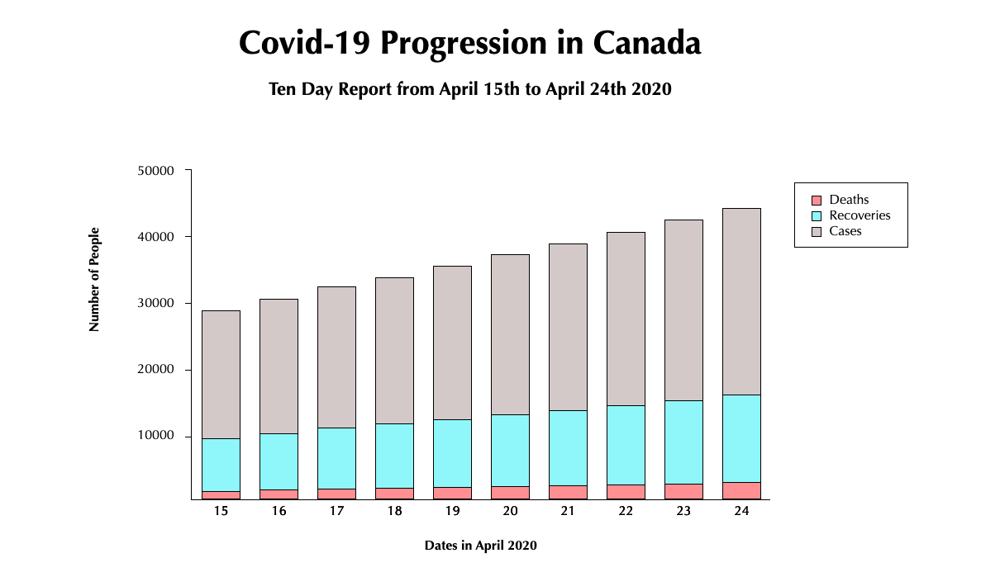
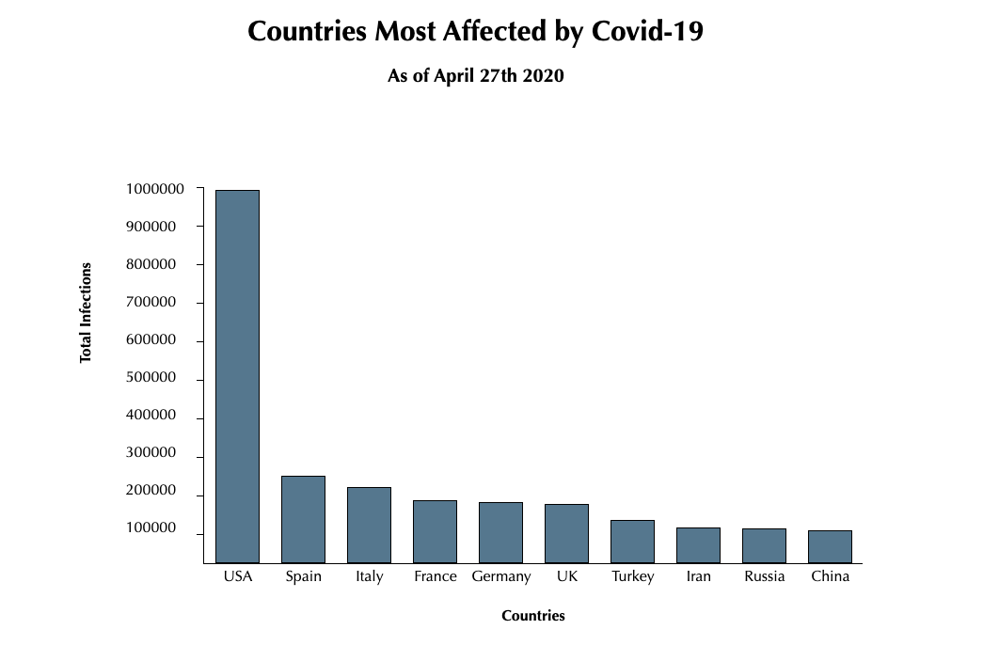
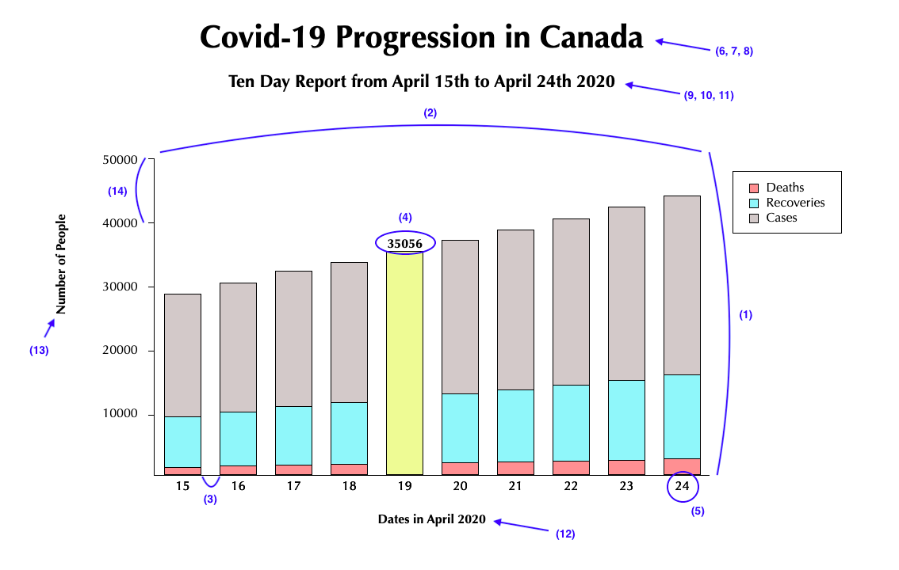

# Bar Chart Generator

 A simple API to generate a custom bar chart tailored to the user's specifications and render it on a demo page. You can create both single and stacked bar charts using this API.

 
***Demo of a stacked bar chart created with this API***

 
 ***Demo of a single bar chart created with this API***

 ## Getting Started

 Clone this repo to your local machine from your terminal command line.
 ```
 $ git clone https://github.com/sophdubs/bar-chart-project.git
 $ cd bar-chart-project.git
 ```

Install the project dependencies 
```
$ npm install
```

## Usage

Open `userFile.js` in your favorite text editor.

At the bottom of the file, you will see the function signature as follows: 

```
drawBarChart(chartData, chartOptions, chartElement);
```

- The **chartData** parameter is the data the chart will work from. 

- The **chartOptions** parameter is an object which has optional customizations for the bar chart. 

- The **chartElement** parameter is a DOM element or jQuery element that the chart will get rendered into.

Format your chartData as specified in the section below. If you decide to rename your chartData object, make sure to update the function signature accordingly.

The chartOptions object with all the required keys is provided in the `userFile.js` file. For keys that you wish to customize, simply replace the current value with your preferred value based on the specifications in the section below. If no customization for that key is desired, simply leave the value as `'null'` and the default settings will be applied. ***Do not edit any of the provided keys or  delete any key/value pairs from the options object.***

The chartElement argument has been handled for you and you do not need to edit this parameter.

Save all your changes to the `userFile.js` file. Open the `index.html` file in your browser to view your custom bar chart on the demo page.

**Note:** Although you cannot see the values of the bars in the demo images above, the values can be seen when hovering over a specific bar. You can see an example of the API in action by following the link to the demo page below:

https://sophdubs.github.io/bar-chart-project/

## Parameters

### chartData 
The `chartData` parameter is an object containing four key-value pairs. For stacked bar charts, all four key-value pairs are required. For single bar charts, the legend value should be `null`.
- **barData**: Array containing sub-arrays of the data for each bar. The nested arrays are to accomodate stacked bar charts which have multiple values for each bar. For single bar charts, you must still nest each bar value within its own array.  
- **barLabels**: Array containing the labels (strings) for each bar. Make sure the order of your labels corresponds to the order of your barData. For example, `barData[0]` should be the data that corresponds to the bar labelled `barLabel[0]`.
- **legend**: Array of strings containing the different labels for the different values in each bar of the stacked bar chart. This will be used to create a legend so the user can determine which bar belongs to which dataset. Make sure the order of the data in each sub array of barData matches the order of the legend array. For example, if `legend[0]` is 'group A', then the values at index 0 in each sub-array of barData should be for group A. If you are creating a single bar chart, the value for legend should be `null`.
- **barColors**: Array of strings with the HEX code of the desired colors for the stacked bars in the bar chart. Make sure the order of the colors match the order of the legend. For example, if you wand `legend[0]` data to be represented by a green bar, then `barColors[0]` should be the HEX code for green.

**Example for single bar chart data object**
```
const chartData = {
  'barData': [[1], [2], [3], [4], [5], [6], [7], [8], [9], [10]],
  'barLabels': ['one', 'two', 'three', 'four, 'five', 'six', 'seven', 'eight', 'nine', 'ten'],
  'barColors': ['#000000'],
  'legend': null
};
```
**Example for stacked bar chart data object**
```
//Percentage of women and men in given professions//
const chartData = {
  'barData': [[97, 3],[84, 16], [76, 24], [61, 39], [40, 60], [27, 73], [3, 97]]
  'barLabels': ['kindergarten teacher', 'librarian', 'flight attendant', 'accountant, 'musicians/singers, 'chiropractors, 'firefighter'],
  'legend': ['Women', 'Men']
  'barColors': ['#f59898', '#a8f3f7'],
};
```

### chartOptions
The options parameter is an object containing fourteen key-value pairs:

***Example of each key-value pair in charOptions on the demo graph***

- **(1)height**: Number representing the desired height of the bar chart in pixels. If no height is provided by the user, the default height is 400px. 
- **(2)width**: Number representing the desired width of the bar chart in pixels. If no width is provided by the user, the default width is 600px.  
- **(3)barSpacing**: Number representing the space between bars in pixels. If no spacing is provided by the user, a default spacing will be applied. 
- **(4)valueColor**: String with the HEX code of the desired color for the numeric values in the bars on the bar chart. If no color is specified, the default color is black. 
- **(5)labelColor**: String with the HEX code of the desired color for the labels below each bar on the X-axis. If no color is specified, the default color is black. 
- **(6)title**: String of the subtitle for your bar chart. If no subtitle is provided, the bar chart will have no subtitle.
- **(7)titleColor**: String with the HEX code of the desired color of the bar chart subtitle. If no color is specified, the default color is black.
- **(8)titleFontSize**: Number representing the font size of the subtitle in pixels. If no font size is provided by the user, a default font size of 50px will be applied.
- **(9)subtitle**: String of the subtitle for your bar chart. If no subtitle is provided, the bar chart will have no subtitle.
- **(10)subtitleColor**: String with the HEX code of the desired color of the bar chart subtitle. If no color is specified, the default color is black.
- **(11)subtitleFontSize**: Number representing the font size of the subtitle in pixels. If no font size is provided by the user, a default font size of 30px will be applied. 
- **(12)xAxis**: String of the X-axis label for your bar chart. If no label is provided, the bar chart will have no X-axis label.
- **(13)yAxis**: String of the X-axis label for your bar chart. If no label is provided, the bar chart will have no X-axis label.
- **(14)tickSpacing**: Number representing the space between ticks on the Y-axis. If no spacing is provided by the user, no ticks will be added to the Y-axis. 

**Example options object**
```
const chartOptions = {
  height: '400',
  width: '700',
  barSpacing: '25px',
  valueColor: '#000000',
  labelColor: '#000000',
  title: 'This is a title',
  titleColor: '#000000',
  titleFontSize: '40px',
  subtitle: 'This is a subtitle',
  subtitleColor: '#000000',
  subtitleFontSize: '22px',
  xAxis: 'This is the x-axis',
  yAxis: 'This is the y-axis',
  tickSpacing: '100'
};
```
**Note:**
For parameters requiring HEX codes, you can follow this link to a color picker page and copy paste the HEX code for your desired color. 
https://www.google.com/search?q=color+picker 

### chartElement 
The element parameter is simple the DOM element to which the demo bar chart will be rendered. As mentioned above, this has already been handled for you and there is no need for you to edit this parameter. 

## Known Bug and/or Issues
### Bugs
- There are no known bugs at this time.
### Issues
- The API is quite demanding when it comes to the format of the input data. If the user is able to follow this README and provide the data and customizations in the correct format, no issues should be present. However if any key/value pairs are removed or renamed in either the `chartData` or `chartOptions` object, the code will break and the bar chart will not be rendered properly.
- Initially, the user could customize the location of the values in each bar of the bar graph. With the addition of 'stacked bar chart' functionality, the bars became too crowded to show the values. Thus, the ability to chose whether the values be shown on the top, center, or bottom of the bar was lost. Now, when a user hovers over a particular bar, that bar changes colors and the bar value is shown above the bar.

## Upcoming Features
- A more forgiving/user-friendly way to submit data and customizations.
- Options for users to customize the animation of the bar graph. 

## Resources
- Setting up ESLint for VS Code: https://marketplace.visualstudio.com/items?itemName=dbaeumer.vscode-eslint
- Understanding how to use jQuery: https://api.jquery.com/
- Javascript related issues: https://developer.mozilla.org/en-US/docs/Web/JavaScript
- Using CSS variables: https://developer.mozilla.org/en-US/docs/Web/CSS/Using_CSS_custom_properties
- Writing and formatting README: https://guides.github.com/features/mastering-markdown/
- Setting up github pages: https://help.github.com/en/github/working-with-github-pages/about-github-pages


